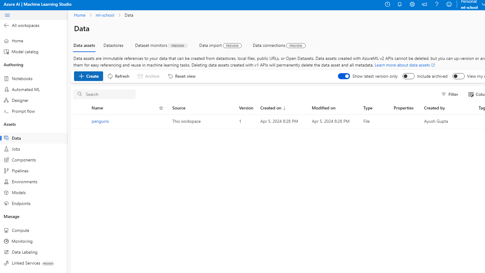
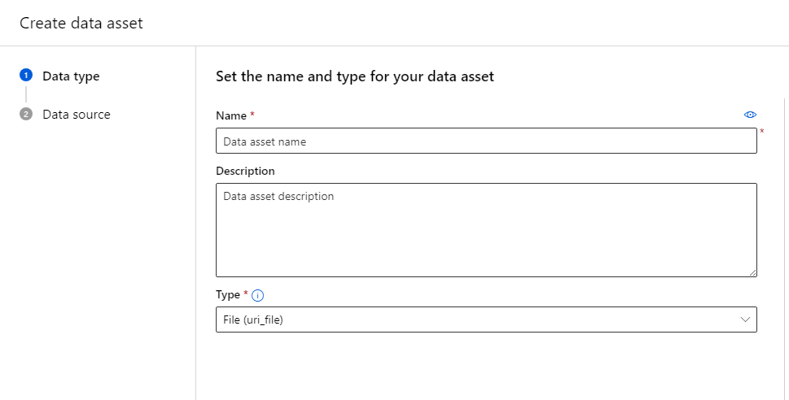
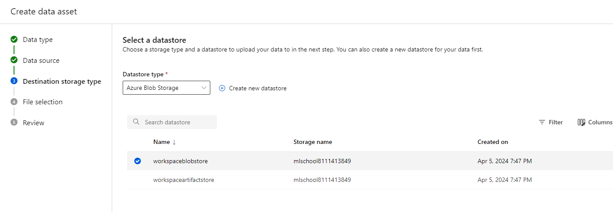
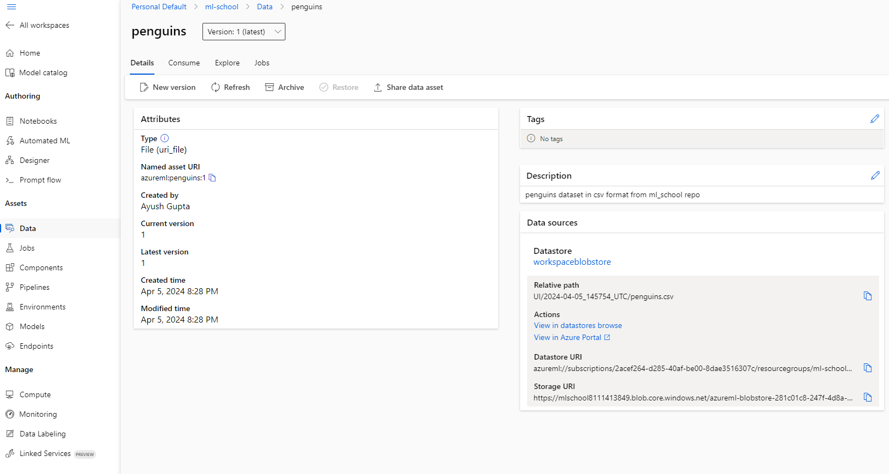

# Steps for Azure

1. Create and setup azure account.
2. Setup Azure cli with ml extension on local machine. Login with your azure account. Steps [here](https://learn.microsoft.com/en-us/azure/machine-learning/how-to-configure-cli?view=azureml-api-2&tabs=public).
3. Create Azure ML studio workspace. You can do it from the cli itself as given in the link above or you can create one on the [portal](https://ml.azure.com). You can also find detailed instructions [here](https://learn.microsoft.com/en-us/azure/machine-learning/quickstart-create-resources?view=azureml-api-2#create-the-workspace). For now, you can skip the compute instance creation part.
4. Setup your dev environment using [these](https://learn.microsoft.com/en-us/azure/machine-learning/how-to-configure-environment?view=azureml-api-2#local-and-dsvm-only-create-a-workspace-configuration-file) steps. Download the config file, name it as `config.json`, and keep it in your project folder. Again, we can skip compute instanace creation as we will do it later programmatically.
5. Setup your virtual env and make sure to include azure ml python sdk `azure-ai-ml`. More info can be found [here](https://learn.microsoft.com/en-us/python/api/overview/azure/ai-ml-readme?view=azure-python)
6. At this point we are ready to code. We can upload the dataset right now or later programmatically. To upload right now, get the `penguins.csv` file. On the workspace page, find the `Data` tab and open it. It should look something like this:

   

7. On the Data tab, click `Create` button under the `Data Assets` tab. Here, given the name of the file, description (if you want) and select `File (uri file)` under the Type. Since we are only using a single file. Once done, click Next.

   

8. In the Data Source tab, select `From local files` and click next.
9. In the Destination Storage type, we will use Azure Blob Storage and you will see that some blob storage is already created as part of the Azure ML workspace creation. I'll select the first one. This is where your datasets will be stored. Click next once done.

   

10. Under `File Selection` tab, click `Upload File` button and select `penguins.csv` file on your local machine. Once done, click next to go to review.
11. Once reviewed, click `Create`. Congratulations, you have created your data asset. You can view the asset on the workspace data tab (see screenshot in step 6). Click on the asset to see its details. The URIs you see on the right will come in handy later.
    
12. To do this programmatically, follow the steps [here](https://learn.microsoft.com/en-us/azure/machine-learning/how-to-create-data-assets?view=azureml-api-2&tabs=python).
